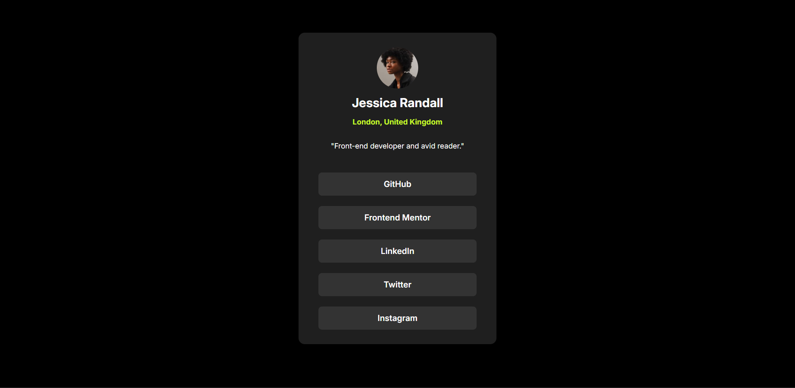
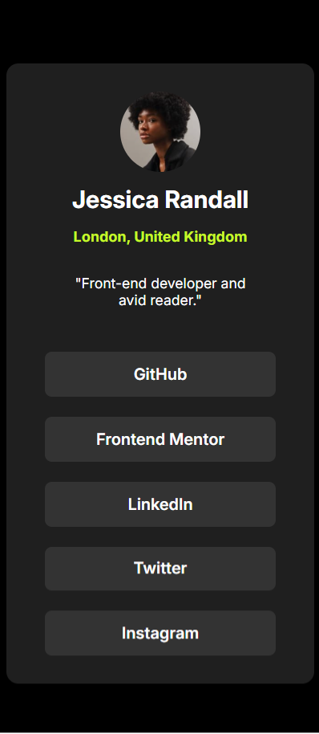

# Social Links Profile Page

A responsive social links profile page for Jessica Randall, built with HTML and CSS. This project showcases a clean design with interactive social media links.




## Features

- Responsive layout using Flexbox
- Google Fonts (Inter) integration
- Hover effects on social links
- Semantic HTML5 structure
- Clean and modern design


## Key Components

### HTML Structure
- Container div for centered content
- Top section with:
  - Profile avatar
  - Name & location
  - Bio description
- Social links list with 5 platforms

### Dependencies
- Google Fonts: Inter (400-900 weights with italics)
- External CSS stylesheet

## Setup Instructions

1. Clone repository:
```bash
git clone https://github.com/yourusername/social-links-profile.git